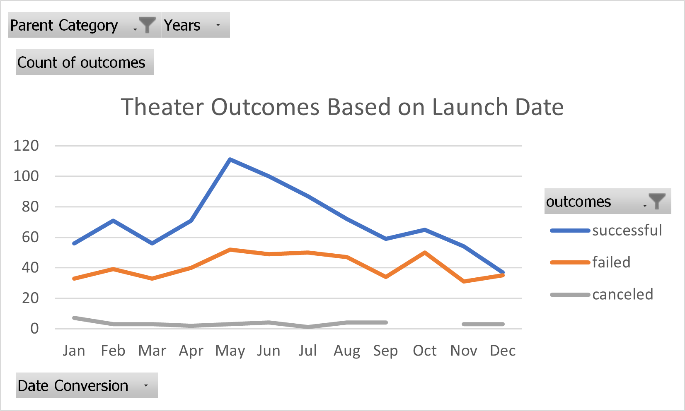
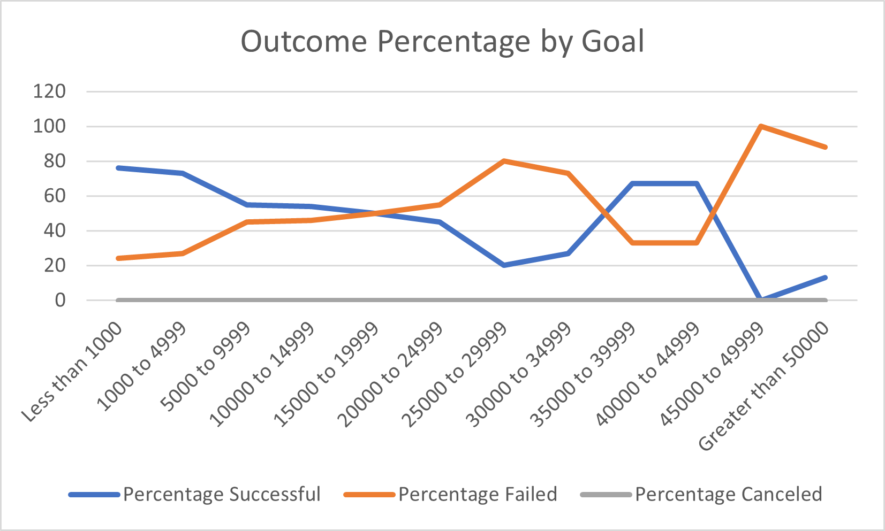

# Kickstarting with Excel

## Overview of Project

### Purpose
The purpose of this analysis was to explain the data to "Louise" pertaining to Kickstarter outcomes and how launch month and funding goal factored-in.  
## Analysis and Challenges
Below is a pivotchart showing trends in outcome by launch month
### Analysis of Outcomes Based on Launch Date

A similar pattern to that of successful projects was seen in failed projects when analyzing the data in terms of months in which they were launched. Below is a chart which shows outcome percentages as functions of funding goals.    
### Analysis of Outcomes Based on Goals

The percentage successful and percentage failed appear to be inversely related when graphed as functions of funding goal.
### Challenges and Difficulties Encountered
Difficulty was had interpreting the data using the charts created. The line charts obscure the analysis by inviting speculation to there being continuation. This is not the case. For instance, the Y-coordinates in the Outcomes vs Launch graph are simply sums of either successful projects, failed projects or canceled projects that were launched in a given month. This would be more easily understood if read from a table. Also, Each of the critical points in the Outcome vs Goal chart has a $5000 interval as the x-value. One can only speak to there being a change in percentage failed or percentage successful for each $5000 increment. 
## Results

- What are two conclusions you can draw about the Outcomes based on Launch Date?
Theater funding projects have been launched in all months. No projects launched in October have been canceled.
- What can you conclude about the Outcomes based on Goals?
Setting a goal in excess of $40000 is not recommended. The rates at which projects failed or achieved success appeared to hold pretty steady when graphed against funding goal across an interval ranging from less than $1000 up to $30000.
- What are some limitations of this dataset?
The likelihood of a project to fail or be achieved is not clear. The rates at which projects failed or achieved success may depend on other factors not included here.
- What are some other possible tables and/or graphs that we could create?
A pie chart can be created for each interval in the Outcome vs. Goal chart showing percentage successful and percentage Failed for each interval.
